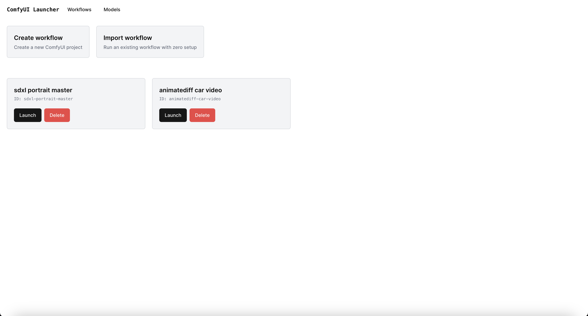
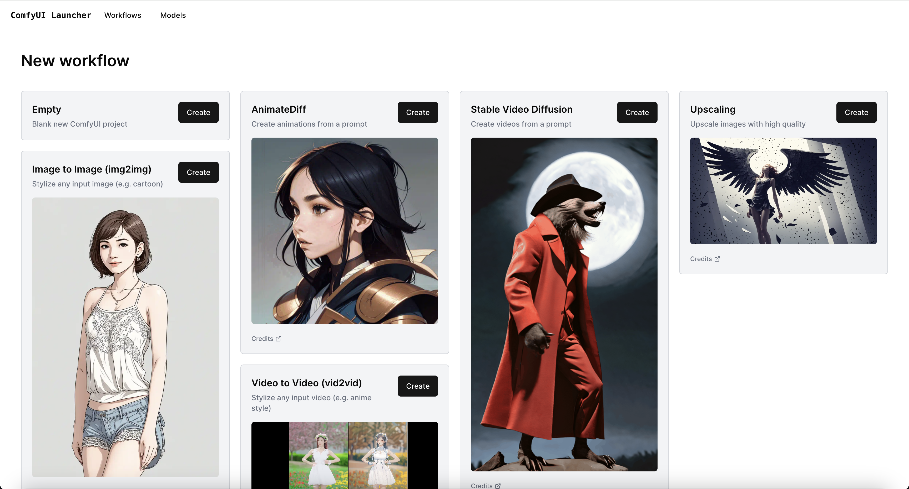
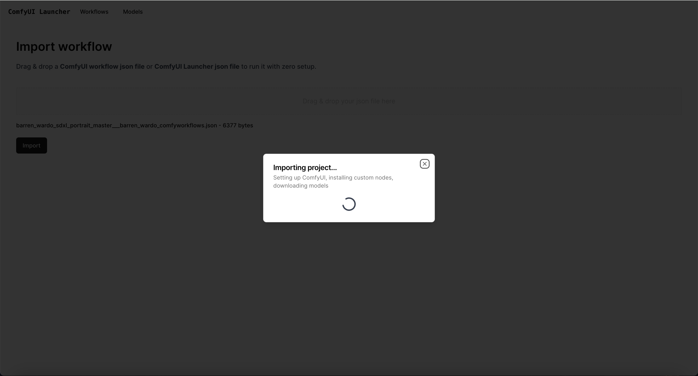
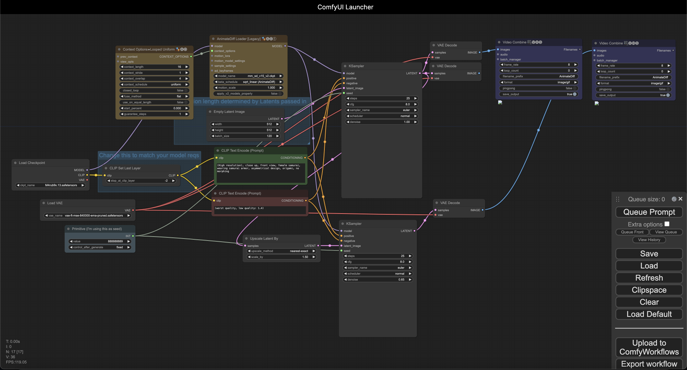

# ComfyUI Launcher (BETA)
Run any ComfyUI workflow w/ **ZERO setup**.

Need help? Join our Discord!

[](https://discord.gg/kXS43yTRNA)

Runs anywhere:
- [Locally](#quick-start)
- [RunPod](/cloud/RUNPOD.md)
- [Huggingface Spaces](https://huggingface.co/spaces/multimodalart/comfyUI-laucher-v2)

## Features
- Automatically installs custom nodes, missing model files, etc.
- Workflows exported by this tool can be run by anyone with **ZERO setup**
- Work on multiple ComfyUI workflows at the same time
- Each workflow runs in its own isolated environment
- Prevents your workflows from suddenly breaking when updating custom nodes, ComfyUI, etc.

<p float="middle">
  
  
  
  
</p>

## Demo

Running a workflow json file w/ no setup

https://github.com/ComfyWorkflows/ComfyUI-Launcher/assets/33400216/aa17680d-eee5-4e6d-abc4-9f7551f9a4ad

## Requirements

#### Windows (Windows Subsystem for Linux - WSL) & Linux:
- Docker (w/ GPU support) or Python 3

#### macOS:
- Python 3

## Quick start

### Option 1: Docker (Linux & Windows)

#### Linux
```
docker run \
--gpus all \ # remove this line if you don't have a GPU or if you're on MacOS
--rm \
--name comfyui_launcher \
-p 4000-4100:4000-4100 \
-v $(pwd)/comfyui_launcher_models:/app/server/models \
-v $(pwd)/comfyui_launcher_projects:/app/server/projects \
-it thecooltechguy/comfyui_launcher
```

### Windows
```
docker run ^
--gpus all ^ # remove this line if you don't have a GPU
--rm ^
--name comfyui_launcher ^
-p 4000-4100:4000-4100 ^
-v %cd%/comfyui_launcher_models:/app/server/models ^
-v %cd%/comfyui_launcher_projects:/app/server/projects ^
-it thecooltechguy/comfyui_launcher
```

Open http://localhost:4000 in your browser

### Option 2: Manual setup (macOS, Linux, and Windows)
Works for **Windows (WSL - Windows Subsystem for Linux)**, **Linux**, & **macOS**

#### Installation (one-time setup)
```
git clone https://github.com/ComfyWorkflows/comfyui-launcher
cd comfyui-launcher/
```

#### Start ComfyUI Launcher
```
./run.sh
```
Open http://localhost:4000 in your browser

If you're facing issues w/ the installation, please make a post in the *bugs* forum on our [discord](https://discord.gg/QvGC8CFGDU)

## Updating
### Option 1: Docker
```
docker pull thecooltechguy/comfyui_launcher
```

### Option 2: Manual setup
```
git pull
```

## Usage

### Using a reverse proxy (advanced)
If you're running ComfyUI Launcher behind a reverse proxy or in an environment where you can only expose a single port to access the Launcher and its workflow projects, you can run the Launcher with `PROXY_MODE=true` (only available for Docker).

```
docker run \
--gpus all \ # remove this line if you don't have a GPU or if you're on MacOS
--rm \
--name comfyui_launcher \
-p 4000:80 \
-v $(pwd)/comfyui_launcher_models:/app/server/models \
-v $(pwd)/comfyui_launcher_projects:/app/server/projects \
-e PROXY_MODE=true \
-it thecooltechguy/comfyui_launcher
```

Once the container is running, all you need to do is expose port 80 to the outside world. This will allow you to access the Launcher and its workflow projects from a single port.

Currently, `PROXY_MODE=true` only works with Docker, since NGINX is used within the container. 
If you're running the Launcher manually, you'll need to set up a reverse proxy yourself (see the `nginx.conf` file for an example).

### Using an existing ComfyUI models folder
When starting the ComfyUI Launcher, you can set the `MODELS_DIR` environment variable to the path of your existing ComfyUI models folder. This will allow you to use the models you've already downloaded. By default, they're stored in `./server/models`

### Using a different folder to store your Launcher projects
When starting the ComfyUI Launcher, you can set the `PROJECTS_DIR` environment variable to the path of the folder you'd like to use to store your projects. By default, they're stored in `./server/projects`

## Donations

If you find our work useful for you, we'd appreciate any donations! Thank you!

<a href="https://www.buymeacoffee.com/comfy.workflows" target="_blank"></a>

## Coming soon
- Native Windows support (w/o requiring WSL)
- Better way to manage your workflows locally
- Run workflows w/ Cloud GPUs
- Backup your projects to the cloud
- Run ComfyUI Launcher in the cloud

## Credits
- ComfyUI Manager (https://github.com/ltdrdata/ComfyUI-Manager/)
  - Used to auto-detect & install custom nodes
